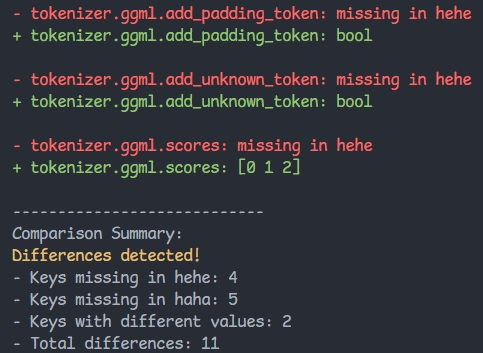

# Ollama Model Compare

A simple command-line tool to compare the metadata and parameters of two [Ollama](https://ollama.ai/) models.

## Overview

Ollama Model Compare helps you identify differences between two Ollama models. It's particularly useful when you:

- Want to compare different versions of the same model
- Need to understand parameter differences between similar models
- Are debugging issues related to model configuration

The tool analyzes the output of `ollama show --verbose` and highlights differences in:
- Model parameters (temperature, top_p, etc.)
- Model architecture
- Metadata properties
- Tensor configurations

## Usage

1. Ensure Ollama is installed and accessible from your command line
2. Run the application
3. Enter the names of the two models you want to compare
4. Review the differences highlighted in the output

```
Ollama Model Comparison Tool
----------------------------
Enter first model name: llama2
Enter second model name: llama2-uncensored

Comparing models llama2 and llama2-uncensored...
```

## Example Output



## Features

- Color-coded differences for easy visual scanning
- Handles missing parameters in either model
- Shows value differences when parameters exist in both models
- Provides a summary report of all differences
- Case-insensitive comparison to avoid false positives

## Requirements

- .NET 7.0 or higher
- Ollama installed and configured

## Building from Source

```bash
dotnet build
```

## License

MIT
